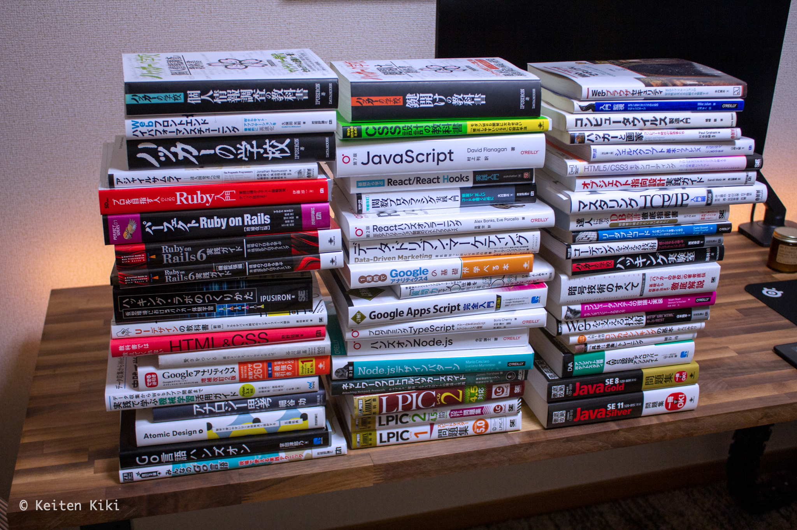

## プロローグ

2021 年も終わろうとしているので今年 1 年に読んだ or 読みかけの本をリストとしてまとめておこうと思う。
今年は技術書を読むことが多かった。それにしても 1 冊の値段が高いね。だからこそ 1 冊と向き合う時間が多かった。

そして、小説やコラムを読むことがほとんどなくなった。
時間は有限であるという考え方から、自分のためになるかならないかで本を選んでいる結果である。
とても有意義に時間を使えたとはいえ、本当にそれで良いのか、心が貧しくなっていないかというのは最近感じる。

## 本の山

ジャンルで分けてみた（順不同）。
リンクは Amazon へのもので、自分への参照用。本のタイトルは Amazon からコピペしている。

### 技術系

#### フロントエンド

- [JavaScript 第 7 版](https://www.amazon.co.jp/dp/4873119707)
- [Web 制作者のための CSS 設計の教科書 モダン Web 開発に欠かせない「修正しやすい CSS」の設計手法](https://www.amazon.co.jp/dp/4844336355)
- [UI デザインの教科書［新版］ マルチデバイス時代のインターフェース設計](https://www.amazon.co.jp/dp/4798155454)
- [教科書では教えてくれない HTML&CSS](https://www.amazon.co.jp/dp/429712193X)
- [基礎から学ぶ React/React Hooks](https://www.amazon.co.jp/dp/486354359X)
- [React ハンズオンラーニング 第 2 版 ―Web アプリケーション開発のベストプラクティス](https://www.amazon.co.jp/dp/4873119383)
- [Web フロントエンド ハイパフォーマンス チューニング](https://www.amazon.co.jp/dp/4774189677)
- [HTML5/CSS3 モダンコーディング フロントエンドエンジニアが教える 3 つの本格レイアウト スタンダード・グリッド・シングルページレイアウトの作り方](https://www.amazon.co.jp/dp/B0176GNY26)
- [Atomic Design ~堅牢で使いやすい UI を効率良く設計する](https://www.amazon.co.jp/dp/477419705X)
- [プログラミング TypeScript ―スケールする JavaScript アプリケーション開発](https://www.amazon.co.jp/dp/4873119049)

#### バックエンド

- [ハンズオン Node.js](https://www.amazon.co.jp/dp/4873119235)
- [Node.js デザインパターン 第 2 版](https://www.amazon.co.jp/dp/4873118735)
- [改訂 2 版 みんなの Go 言語](https://www.amazon.co.jp/dp/4297107279)
- [Go 言語 ハンズオン](https://www.amazon.co.jp/dp/4798063991)
- [詳解! Google Apps Script 完全入門 [第 3 版]](https://www.amazon.co.jp/dp/4798064742)
- [プロを目指す人のための Ruby 入門 言語仕様からテスト駆動開発・デバッグ技法まで](https://www.amazon.co.jp/dp/4774193976)
- [パーフェクト Ruby on Rails 【増補改訂版】](https://www.amazon.co.jp/dp/4297114623)
- [Ruby on Rails 6 実践ガイド](https://www.amazon.co.jp/dp/4295008052)
- [Ruby on Rails 6 実践ガイド[機能拡張編]](https://www.amazon.co.jp/dp/4295008877)
- [オブジェクト指向設計実践ガイド　～ Ruby でわかる 進化しつづける柔軟なアプリケーションの育て方](https://www.amazon.co.jp/dp/B01L8SEVYI)
- [達人に学ぶ DB 設計 徹底指南書](https://www.amazon.co.jp/dp/B00EE1XPAI)

#### セキュリティ

- [ネットワークプロトコルハッカーズガイド キャプチャ、解析、エクスプロイトの理論と実践](https://www.amazon.co.jp/dp/4048930915)
- [ハッキング・ラボのつくりかた 仮想環境におけるハッカー体験学習](https://www.amazon.co.jp/dp/4798155306)
- [Web ブラウザセキュリティ Web アプリケーションの安全性を支える仕組みを整理する](https://www.amazon.co.jp/dp/4908686106)
- [コンピュータウイルス製造入門](https://www.amazon.co.jp/dp/4781700586)
- [ハッカーの学校](https://www.amazon.co.jp/dp/4781701973)
- [ハッカーの学校 ハッキング実験室](https://www.amazon.co.jp/dp/4781702279)
- [暗号技術のすべて](https://www.amazon.co.jp/dp/4798148814)

#### データ分析

- [1 週間で Google アナリティクス 4 の基礎が学べる本](https://www.amazon.co.jp/dp/429501172X)
- [できる逆引き Google アナリティクス 増補改訂 2 版 Web 解析の現場で使える実践ワザ 260](https://www.amazon.co.jp/dp/4295002569)
- [データ収集から Web アプリ開発まで 実践で学ぶ機械学習活用ガイド](https://www.amazon.co.jp/dp/4839969221)

#### 資格

- [Linux 教科書 LPIC レベル 1 スピードマスター問題集 Version5.0 対応](https://www.amazon.co.jp/dp/4798160857)
- [Linux 教科書 LPIC レベル 2 スピードマスター問題集 Version4.5 対応](https://www.amazon.co.jp/dp/4798151238)
- [Linux 教科書 LPIC レベル 2 Version 4.5 対応](https://www.amazon.co.jp/dp/4798151254)
- [徹底攻略 Java SE 11 Silver 問題集[1Z0-815]対応](https://www.amazon.co.jp/dp/4295007625)
- [徹底攻略 Java SE 8 Gold 問題集[1Z0-809]対応](https://www.amazon.co.jp/dp/4295000035)
- [ポケットスタディ AWS 認定 デベロッパーアソシエイト](https://www.amazon.co.jp/dp/4798063401)

#### その他

- [マスタリング TCP/IP―入門編―(第 6 版)](https://www.amazon.co.jp/dp/4274224473)
- [UNIX という考え方―その設計思想と哲学](https://www.amazon.co.jp/dp/4274064069)
- [リーダブルコード ―より良いコードを書くためのシンプルで実践的なテクニック](https://www.amazon.co.jp/dp/4873115655)
- [コーディングを支える技術 ~成り立ちから学ぶプログラミング作法](https://www.amazon.co.jp/dp/477415654X)
- [アジャイルサムライ − 達人開発者への道 −](https://www.amazon.co.jp/dp/4274068560)
- [ハッカーと画家 コンピュータ時代の創造者たち](https://www.amazon.co.jp/dp/4274065979)
- [Web を支える技術 -HTTP、URI、HTML、そして REST](https://www.amazon.co.jp/dp/4774142042)
- [[増補改訂]関数プログラミング実践入門 ── 簡潔で、正しいコードを書くために](https://www.amazon.co.jp/dp/4774183903)
- [コンピュータシステムの理論と実装 ―モダンなコンピュータの作り方](https://www.amazon.co.jp/dp/4873117127)
- [入門 監視 ―モダンなモニタリングのためのデザインパターン](https://www.amazon.co.jp/dp/4873118646)
- [[改訂第 3 版]シェルスクリプト基本リファレンス ──#!/bin/sh で、ここまでできる](https://www.amazon.co.jp/dp/4774186945)

### 技術以外

- [博報堂クリエイティブプロデューサーが明かす 「質問力」って、じつは仕事を有利に進める最強のスキルなんです。](https://www.amazon.co.jp/dp/4804718591)
- [データ・ドリブン・マーケティング―――最低限知っておくべき 15 の指標](https://www.amazon.co.jp/dp/4478039631)
- [「具体 ⇄ 抽象」トレーニング 思考力が飛躍的にアップする 29 問](https://www.amazon.co.jp/dp/4569845991)
- [マンガでわかる! 入社 1 年目からのロジカルシンキングの基本](https://www.amazon.co.jp/dp/4797383666)
- [アナロジー思考](https://www.amazon.co.jp/dp/4492556974)
- [賢さをつくる 頭はよくなる。よくなりたければ。](https://www.amazon.co.jp/dp/4484192330)

### 電子書籍（Kindle）

- [東京百景](https://www.amazon.co.jp/dp/B0892CMTTW)
- [メタ思考トレーニング 発想力が飛躍的にアップする 34 問](https://www.amazon.co.jp/dp/B01FSE8D1K)
- [シックスサマナ 第 35 号 性地巡礼 未開の性域を旅して](https://www.amazon.co.jp/dp/B081HDTKGW)
- [その悩み、哲学者がすでに答えを出しています](https://www.amazon.co.jp/dp/B07C6Z16K4)
- [封印されたアダルトビデオ](https://www.amazon.co.jp/dp/B0089JL274)
- [成りあがり](https://www.amazon.co.jp/dp/B00H3CUIIC)
- [パーソナリティ障害 いかに接し、どう克服するか](https://www.amazon.co.jp/dp/B0081BBEY6)
- [知ってそうで知らなかった ほんとうの株のしくみ](https://www.amazon.co.jp/dp/B00H8LHYEE)

## どのような本を読むべきか

こう見ると偏ってるな。時間を無駄にしたくないのである程度調べて良書と呼ばれている本を中心に読んだ。
技術系だとオライリーや技術評論社の本は面白くて何度も見返したくなる本ばかりだ。エンジニアにはおすすめ。
ただ、プログラミング言語や OSS はウェブ上にドキュメントがあるのでわざわざ高いお金を払ってまで本を買わなくても良さそうな気がしてきた。
まず読むべきは公式ドキュメント、次に本。自分もブログを書いててこう言うのは何だが、技術ブログは当てにならない（技術の進歩が早すぎるとも言える）。

2022 年は技術系を減らしてビジネスや投資・株関係の本を多めに読みたいと思っている。
エンジニアだけでなくあらゆる技術職に関連する話だが、ある程度の時間をかければ誰でも大抵の仕事はできるようになる。
自分以外に代替が効くことをやり続けても社会的な価値は上がらないから、どうすればレバレッジが効くかを考えたい。

本音はのんびりとドストエフスキーを読みたい。
